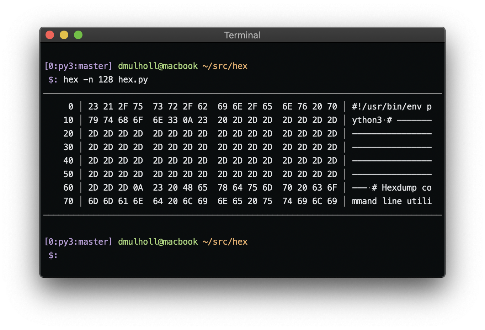

# Hex

[1]: http://www.dmulholl.com/dev/hex.html

Hex is a simple hexdump utility implemented in Python.

    

See the [documentation][1] for details.

If you're looking for something a bit fancier, here's a link to a fork with extra options for formatting and colorized output:

* https://github.com/0xflotus/hex2/
